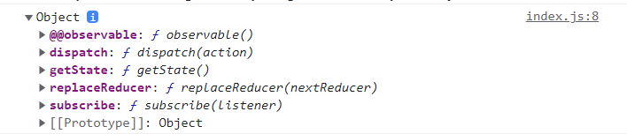
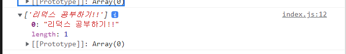

# Redux 연습장

## 리덕스의 액션이란?

- 액션은 사실 그냥 객체(object)이다.
- 두 가지 행태의 액션이 있다.
  ```js
  {
    type: "TEST";
  } // payload 없는 액션
  ```
  ```js
  {type: 'TEST', params: 'hello'} // payload 있는 액션
  ```
- type 만이 필수 프로퍼티이며, type은 문자열이다.

## 리덕스의 액션 생성자란 ?

```js
function 액션생성자(...args) {
  return 액션;
}
```

- 액션을 생성하는 함수를 "액션 생성자(Action Creator")라고 한다.
- 함수를 통해 액션을 생성해서, 액션 객체를 리턴해줍니다.

```js
createTest("hello"); // {type: "TEST", params: "hello"} 리턴
```

## 리덕스에서 액션이 하는 일

- 액션 생성자를 통해 액션을 만들어 낸다.
- 만들어낸 액션 객체를 리덕스 스토어에 보낸다.
- 리덕스 스토어가 액션 객체를 받으면 스토어의 상태 값이 변경된다.
- 변경된 상태 값에 의해 상태를 이용하고 있는 컴포넌트가 변경된다.
- 액션은 스토어에 보내는 일종의 인풋이라 생각할 수 있다!!

## 액션을 준비하기 위한 단계

1. 액션의 타입을 정의하여 변수로 빼는 단계
   - 강제는 아니므로 안 해도된다
   - 그냥 타입을 문자열로 넣기에는 실수를 유발할 가능성이 크다.
   - 미리 정의한 변수를 사용하면, 스펠링에 주의를 덜 기울여도 된다.
2. 액션 객체를 만들어 내는 함수를 만드는 단계
   - 하나의 액션 객체를 만들기 위해 하나의 함수를 만들어낸다.
   - 액션의 타입은 미리 정의한 타입 변수로부터 가져와 사용한다.

```js
export const ADD_TODO = "ADD_TODO";

// 모든 액션의 정의하고 액션 생성 함수를 만드는 곳이다.
// 액션의 타입을 정의하고 액션의 생성자를 생성
function addTodo(todo) {
  return {
    type: ADD_TODO,
    todo: todo,
  };
}
```

<hr/>

## 리덕스의 리듀서란

- 액션을 주면, 그 액션이 적용되어 달라진 결과를 만들어 준다.
- 그냥 함수이다.
  - Pure Function
  - Immutable
    - 리듀서를 통해 state가 달라졌음을 리덕스가 인지하는 방식

```js
function 리듀서(previousState, action) {
  return newState;
}
```

- 액션을 받아서 state를 리턴하는 구조
- 인자로 들어오는 priviousState와 리턴되는 newState는 다른 참조를 가지도록 해야한다.

```js
import { ADD_TODO } from "./actions";

// state
// ['코딩', '점심먹기'];

const initialState = []; // 초기값을 설정

export function todoApp(previousState = initialState, action) {
  if (action.type === ADD_TODO) {
    return [...previousState, action.todo];
  }

  return previousState; // 아무 변화가 없을 때 previousState반환
}
```

<hr />

## 스토어를 만드는 함수

```js
const store = createStore(리듀서);
```

createStore는 다음과 같이 3개의 인자가 들어간다.

```js
createStore<S>(
    reducer: Reducer<S>, // 하나는 reducer함수 위의 todoApp과 같은 함수
    preloaderState: S, // initialState를 넣을 수 있다.
    enhancer?: StoreEnhancer<S>
):Store<S>;
```

우선 다음과 같이 스토어를 생성하여 리듀서를 가져왔다.

```js
import { createStore } from "redux";
import { todoApp } from "./reducers";

const store = createStore(todoApp); //todoApp 리듀서를 가져와 store로 지정

export default store;
```

그리고 이 store를 확인하기 위하여 index.js에서 콘솔을 찍어 확인을 해보자


다음과 같은 객체들이 들어있는것을 볼 수 있다.
다음 함수중 action을 인자로 가지는 dispatch함수가 있는데 이action를 생성을 해보려고한다.

```js
store.dispatch(addTodo("리덕스 공부하기!!"));
```

이 action을 변경을 할 때 직접 리터럴로 작성하는것이 아닌 action을 생성하는 함수인 addTodo를 실행하면서 todo를 넣어주면 action이 생성되면서 dispatch로 전달이되면서 store에 도착이된다.  
그러면 store에서 state가 변경이 된다!  
다음 결과를 index.js에서 콘솔로 찍어보면

이렇게 생성이 된 것을 볼 수 있다.

## store의 기능

- store.getState();
- store.dispatch(액션);, store.dispatch(액션생성자());
- const unsubscribe = store.subscribe(()=>{});
  - 리턴이 unsubscribe라는 점
  - unsubscribe();하면 제거
- store.replaceReducer(다른리듀서);

- 업로드중
